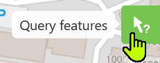
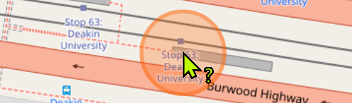
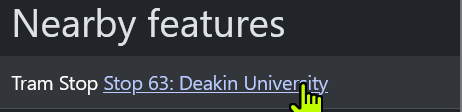
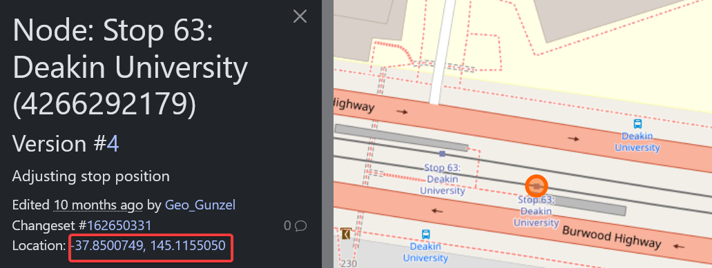
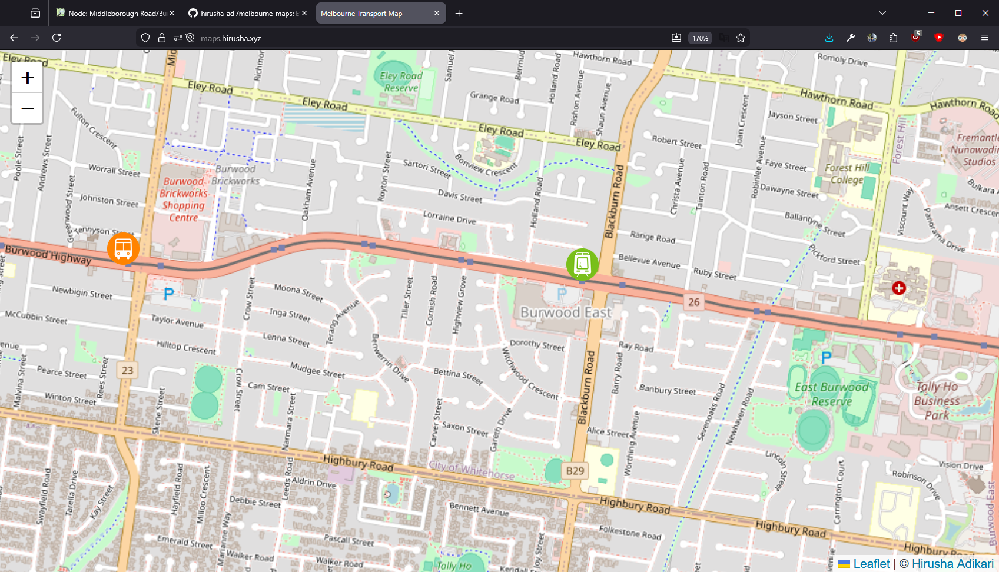
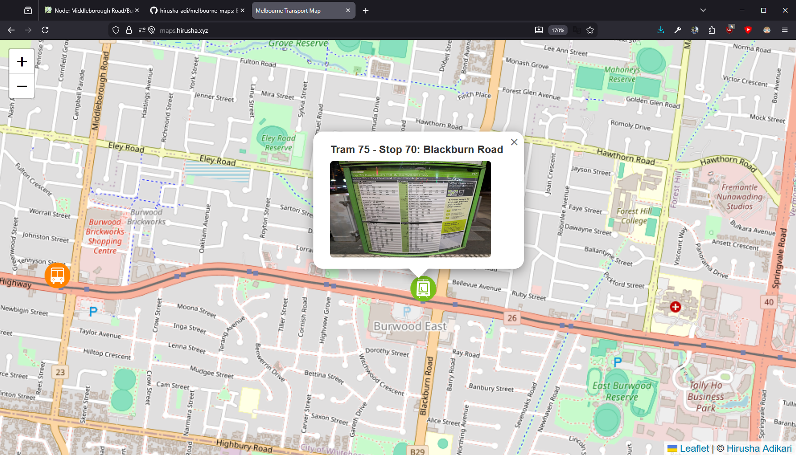
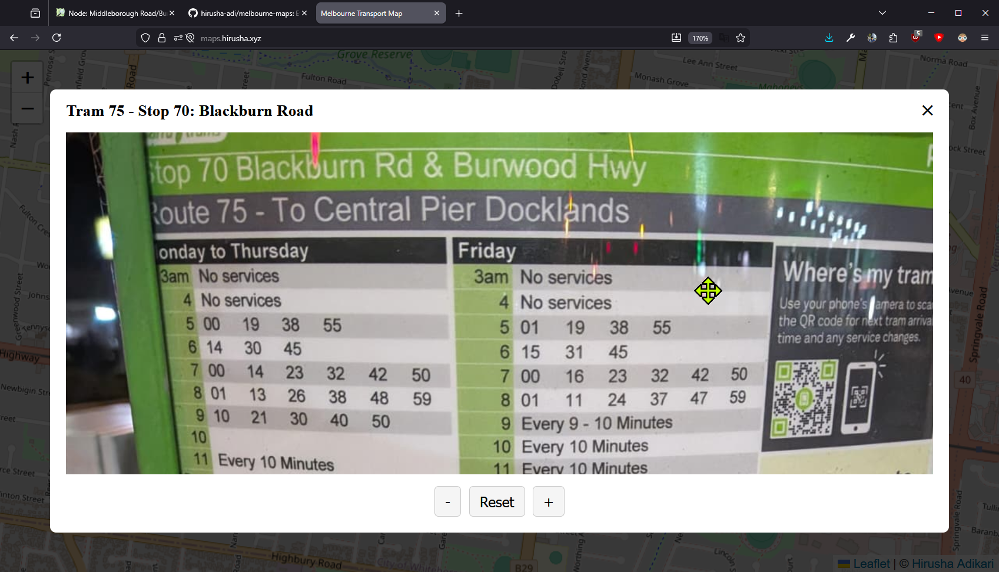

# Melbourne Maps

Even the PTV app is unreliable sometimes... I've wasted so much time. This is for my personal use. I just wanted a barely functional thing. Visit the website at [maps.hirusha.xyz](https://maps.hirusha.xyz).

## Project Structure

Below is a look at the relevant files for the functioning of this website.

```bash
.
├── CNAME           # for custom domain with GH pages
├── data.json       # all added stops are saved here
├── index.html      # website's code
│
├── icons/          # icons used by the website
│   ├── bus.png     # PTV's orange bus icon
│   └── tram.png    # PTV's green tram icon
│
└── images/
    ├── demo_image_1.png                # image used for demos
    ├── bus_r732_middleborough_rd.png   # image for a bus entry
    └── tram_r75_s70.png                # image for a tram entry
```

### Image Naming Convention

#### Buses

Common Format: `bus_r{ROUTE-NUMBER}_{STOP-NAME/NUMBER}`.

Let's look at an example: `bus_r732_middleborough_rd`,
- `bus_` prefix indicates that this is a bus
- `r732_` tells that this is the 732 bus route
- `middleborough_rd` is the name of that stop

#### Trams

Common Format: `tram_r{ROUTE-NUMBER}_s{STOP-NUMBER}`.

Let's look at an example: `tram_r75_s70`,
- `tram_` prefix indicates that this is a tram
- `r75_` tells that this is the 75 tram line
- `s70` is the stop number

#### Demonstrations

Just start the name with the `demo_` prefix and go nuts!

### Adding New Stops

1. Head to [OpenStreetMaps](https://www.openstreetmap.org/#map=11/-37.8165/144.9436). Log in if you haven't already.
2. Zoom in on the place you want to add.
3. Select the "Query features" option.
    - 
4. Click on where you want to select.
    - 
5. Select the correct node from the sidebar.
    - 
6. Note the coordinates down.
    - 
7. Rename your image to the correct format and place it inside `./images/`.
8. Open and add the entry to `./data.json`. This should be very obvious. Use the longitude and latitude values notes from OpenStreetMaps previously. Ensure the `imageUrl` key has the `images/` prefix.

Ideally, to keep things simple, please use the same image name as the `id` of the entry.

## To-Do

- Improve the design on mobile (almost unusable at the current state).
- Add more tram_r75 stops around me, tram_r70_s60, 767 bus, more 732 bus, 903 bus.

## Screenshots







